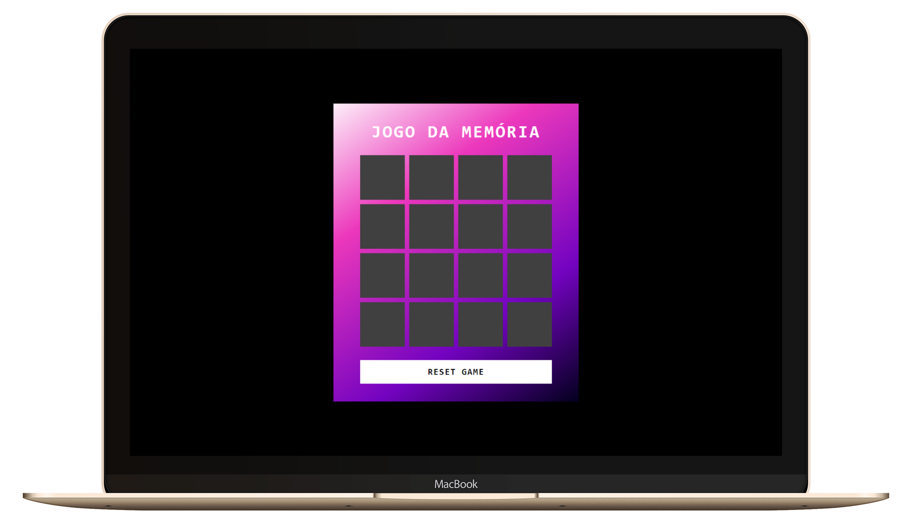

# Entrega de projeto - Criando um Jogo da memória com Emojis Utilizando Javascript | DIO

Este projeto consiste em criar um jogo da memória utilizando HTML, CSS e JavaScript, com o teclado de emojis do Windows. Eu sxplorie bastante a estilização CSS e eventos JavaScript para criar uma experiência de jogo interativa e divertida.

## Objetivos

- Criar o layout do jogo utilizando HTML e CSS
- Implementar a lógica do jogo com JavaScript
- Utilizar eventos JavaScript para detectar interações do usuário
- Explorar estilizações avançadas com CSS para criar uma interface atraente

## Tecnologias Utilizadas

- `index.html`: Arquivo principal do HTML.
- `style.css`: Arquivo de estilos CSS.
- `script.js`: Arquivo principal de JavaScript.

## Como Executar o Projeto

1. Clone o repositório:

   ```bash
   git clone https://github.com/fabiocasadossites/desafio-javascript-jogoDaMemoria-dio.git
   ```

2. Navegue até o diretório do projeto:

   ```bash
   cd nome-do-repositorio
   ```

3. Abra o arquivo index.html

<br>

### Veja o projeto

[Link do projeto](https://fabiocasadossites.github.io/desafio-javascript-jogoDaMemoria-dio/)

<br>

## 👨‍💻 Expert

<p>
    
    <p>&nbsp&nbsp&nbspFabio Augusto<br>
    &nbsp&nbsp&nbsp
    <a href="https://github.com/fabiocasadossites">
    GitHub</a>&nbsp;|&nbsp;
    <a href="https://www.linkedin.com/in/fabioasa/">LinkedIn</a>
&nbsp;|&nbsp;
    <a href="https://www.fabioaugusto.dev/">
    Portfolio </a>
&nbsp;&nbsp;</p>
</p>
<br/>
<p>

💻 com ❤️ por [Fabio Augusto](https://github.com/fabiocasadossites)

